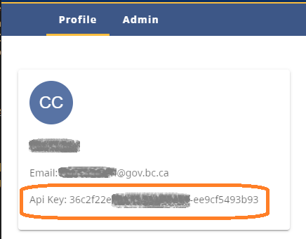

# **Common calls using the BC Data Catalogue API**

-------------

||**Audience** | |
|:---:|:---:|:---:|
| [*Catalogue Editors*](../glossary.html#metadata_editor) | [*Catalogue Admin*](../glossary.html#metadata_admin) | *Catalogue Developers* |

## Table of Contents
+ [**How to get information**](#how-to-get-information)
    + [**How to get your API Key**](#how-to-get-your-api-key)
    + [**How to get names and IDs from the UI**](#how-to-get-names-and-ids-from-the-ui)
    + [**How to get the organization ID with the organization name**](#how-to-get-the-organization-id-with-the-organization-name)
    + [**How to get package names and package IDs within an organization**](#how-to-get-package-names-and-package-ids-within-an-organization)
    + [**How to get the resource names and resource IDs withing a package**](#how-to-get-the-resource-names-and-resource-ids-withing-a-package)
+ [**Common calls**](#common-calls)
    + [**object name**](#object_name)
    + [**bcdc type**](#bcdc_type)
    + [**resource storage location**](#resource_storage_location)
    + [**format**](#format)
    + [**licence_id**](#licence_id)

-----------------------
**Resources**
+ See the full list of value options for drop down fields, see the [BCDC Schema](https://catalogue.data.gov.bc.ca/api/3/action/scheming_dataset_schema_show?type=bcdc_dataset)
+ See all documented changes in the [Change Log](https://github.com/bcgov/ckan-ui/blob/master/pages/beta_schema_changes.md#application-resource-level-changes)

-----------------------
## How to get information

\* You do not need an API key nor an account if you are only accessing publicly available data. All records published under the Open Government Licence - British Columbia and its variations are publicly available.

If you have questions about accessing data in the B.C. Data Catalogue, please submit a support request via our [request portal](https://dpdd.atlassian.net/servicedesk/customer/portal/1).

### How to get your API Key

1. Log into the Catalogue
1. Click on the hamburger/pancake in the upper right
1. Click on *Account Settings*


4. Bottom left corner is your personal API Key



[RETURN TO TOP][1]

### How to get names and IDs from the UI

+ When navigating pages in the Catalogue, the URL will contain the **name**
+ When using the **Share** button on those pages, the ID will be copied to your clipboard. Minus that of resource that uses only the id.

**Examples**:
 + organization name : ../organization/**information-management-cfd**
 + organization ID : ../organization/**a1a9c5cc-b601-4190-b206-13ba08c54292**
 + package (dataset) name : ../dataset/**bc-data-catalogue-content**
 + package (dataset) id : ../dataset/**42f7ca99-e7f3-40f7-93d7-f2500cccc315**
 + resource id : ...dataset/bc-data-catalogue-content/resource/**b67e8cfc-32c1-4fd5-be08-ce30542b2a6c**

 [RETURN TO TOP][1]

### How to get your organization name

```
import ckanapi

ckan = ckanapi.RemoteCKAN('https://catalogue.data.gov.bc.ca', apikey='YOUR-APIKEY-HERE')

org = ckan.action.organization_show(id="information-management-cfd")
print(org['name'], org['id'])
```

[RETURN TO TOP][1]

### How to get package names and package IDs within an organization
```
import ckanapi

ckan = ckanapi.RemoteCKAN('https://catalogue.data.gov.bc.ca', apikey='YOUR-APIKEY-HERE')

pkgs = ckan.action.package_search(fq="owner_org:a1a9c5cc-b601-4190-b206-13ba08c54292",rows=1000)
for pkg in pkgs['results']:
    print(pkg['name'], pkg['id'])

```

[RETURN TO TOP][1]

### How to get the resource names and resource IDs within a package
```
import ckanapi

ckan = ckanapi.RemoteCKAN('https://catalogue.data.gov.bc.ca', apikey='YOUR-APIKEY-HERE')

pkg_data = ckan.action.package_show(id="b67255a7-8040-43c0-935c-d74f168af215")
for resource in pkg_data['resources']:
    print(resource['name'], resource['id'])
```

[RETURN TO TOP][1]

## Common calls

+ **Licence list** is found [here](https://licenses-bcdc.data.gov.bc.ca/bcdc_licenses.json).
+ **JSON Schema** is found [here](https://catalogue.data.gov.bc.ca/api/3/action/scheming_dataset_schema_show?type=bcdc_dataset).

### object_name
[https://catalogue.data.gov.bc.ca/api/3/action/package_search?q=res_extras_object_name:WHSE_WILDLIFE_MANAGEMENT.WAA_TRAPLINE_AREAS_SP](https://catalogue.data.gov.bc.ca/api/3/action/package_search?q=res_extras_object_name:WHSE_WILDLIFE_MANAGEMENT.WAA_TRAPLINE_AREAS_SP)

Depending on what is being used to make the call, changing the : and wrapping the object name in quotes may be needed
[https://catalogue.data.gov.bc.ca/api/3/action/package_search?q=res_extras_object_name%3A%22WHSE_WILDLIFE_MANAGEMENT.WAA_TRAPLINE_AREAS_SP%22](https://catalogue.data.gov.bc.ca/api/3/action/package_search?q=res_extras_object_name%3A%22WHSE_WILDLIFE_MANAGEMENT.WAA_TRAPLINE_AREAS_SP%22)


### bcdc_type
[https://catalogue.data.gov.bc.ca/api/3/action/package_search?q=res_extras_bcdc_type:geographic](https://catalogue.data.gov.bc.ca/api/3/action/package_search?q=res_extras_bcdc_type:geographic)

### resource_storage_location
[https://catalogue.data.gov.bc.ca/api/3/action/package_search?q=res_extras_resource_storage_location:bc%20geographic%20warehouse](https://catalogue.data.gov.bc.ca/api/3/action/package_search?q=res_extras_resource_storage_location:bc%20geographic%20warehouse)

### format
[https://catalogue.data.gov.bc.ca/api/3/action/package_search?q=res_format:csv](https://catalogue.data.gov.bc.ca/api/3/action/package_search?q=res_format:csv)

### licence_id
[https://catalogue.data.gov.bc.ca/api/3/action/package_search?q=license_id:2](https://catalogue.data.gov.bc.ca/api/3/action/package_search?q=license_id:2)


-------------------------------------------------------
[RETURN TO TOP][1]

[1]: #Common-calls-using-the-BC-Data-Catalogue-API